# 🍎 Fruit Market App

Fruit Market is a modern Flutter mobile application for online fruit and grocery shopping, designed with a clean user interface and smooth user experience.

  
  
  
  

## ✨ Features

* Splash Screen with animation
* OnBoarding flow
* Phone Authentication using Firebase
* OTP Verification
* Home screen with dynamic fruit products
* Product Details
* Shopping Cart
* Favorites
* Payment Methods
* Add Credit Card
* Notifications
* Profile Management
* Settings Screen
* Responsive UI for all devices

## 🛠 Tech Stack

* Flutter
* Dart
* GetX
* Firebase Authentication
* REST API Integration using Dio
* Responsive Design

## 📱 Screenshots

  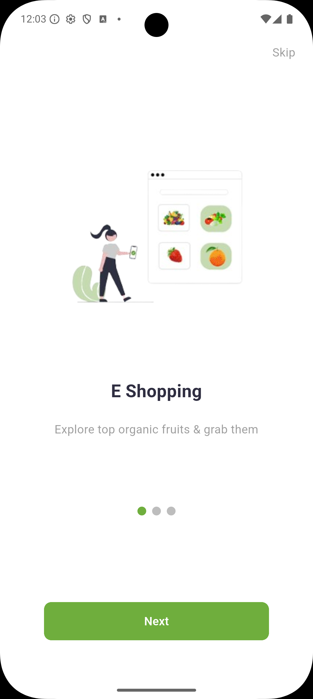
  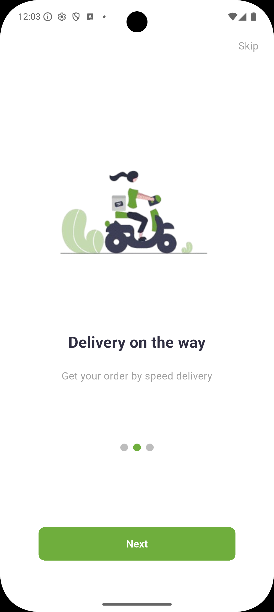
  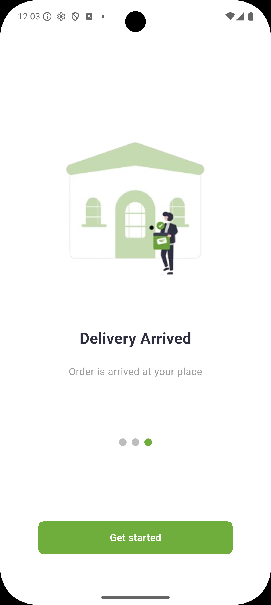
  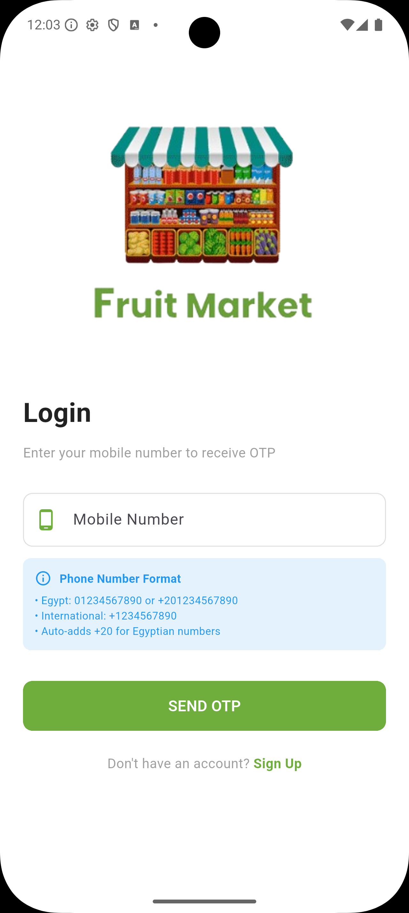
  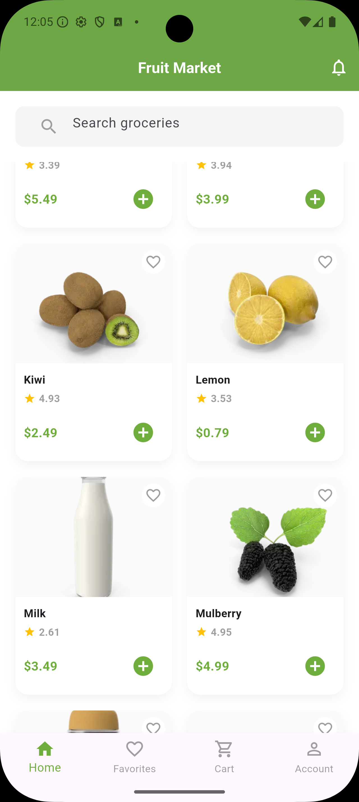
  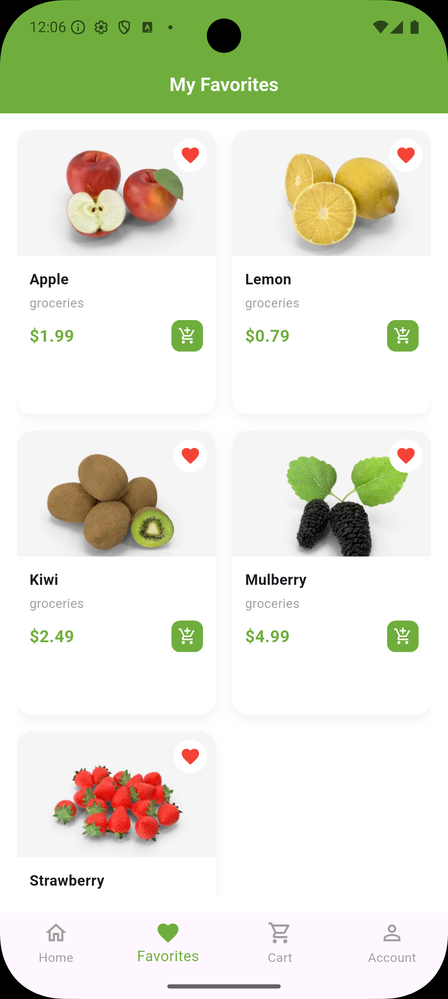
  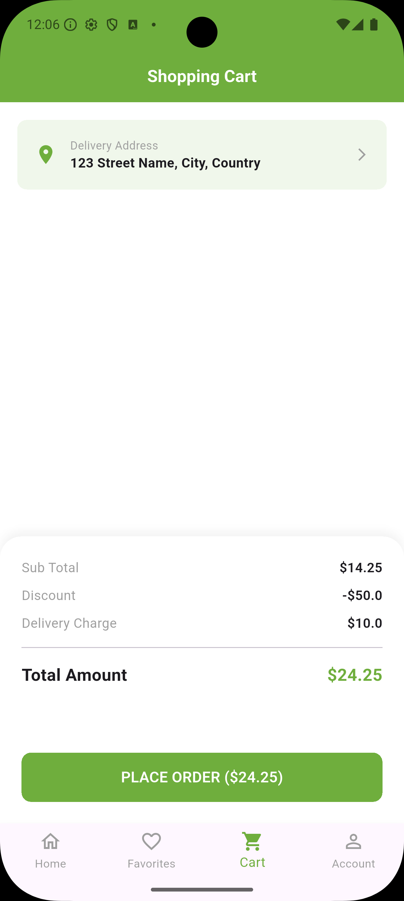
  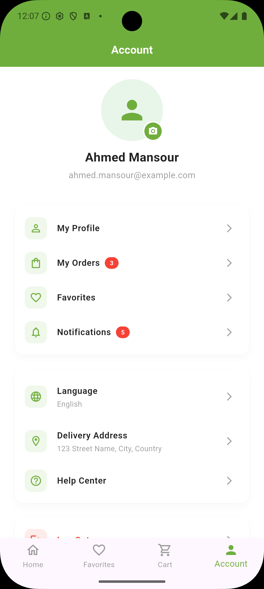
  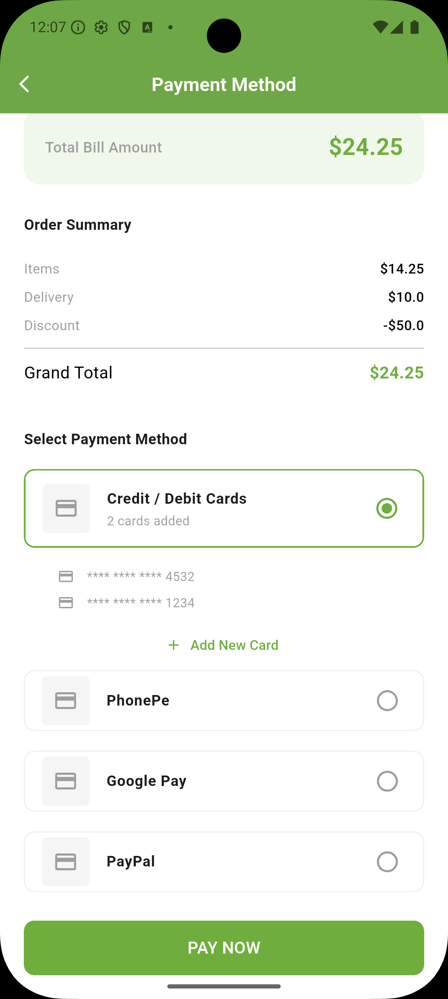
  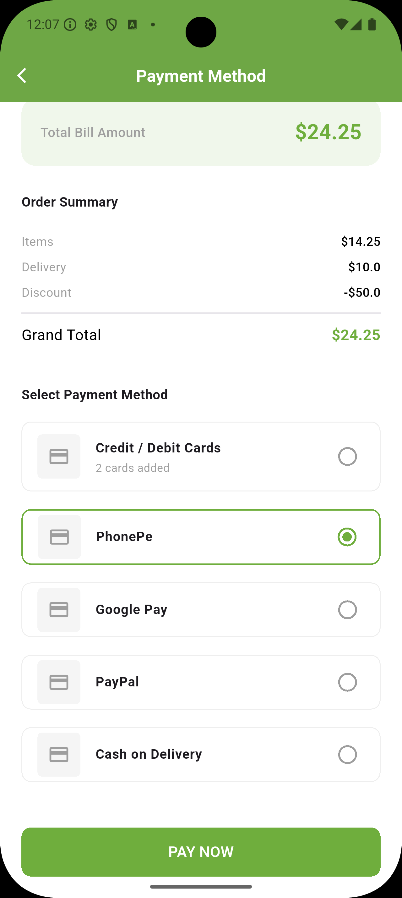
  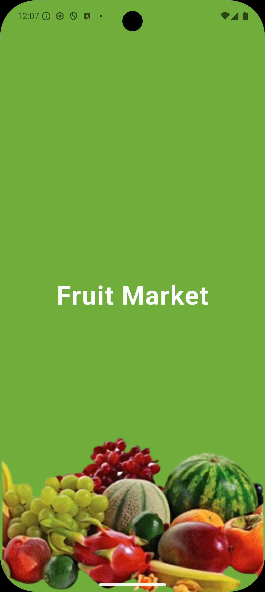

## 📦 Architecture

The project follows clean architecture with reusable widgets and organized folders:

lib/

* core/
* features/
* widgets/
* models/
* services/

## 🌐 API Used

https://dummyjson.com/products/category/groceries

## 🔐 Authentication

Firebase Phone Authentication is used for:

* Sending OTP
* Phone verification
* User login

## 📱 Main Screens

* Splash
* OnBoarding
* Login
* OTP Verification
* Home
* Product Details
* Cart
* Payment
* Profile
* Settings

## 🚀 Getting Started

1. Clone the repository
2. Run flutter pub get
3. Connect Firebase
4. Run the project

(Add your screenshots here)

## 👨‍💻 Developed with Flutter
